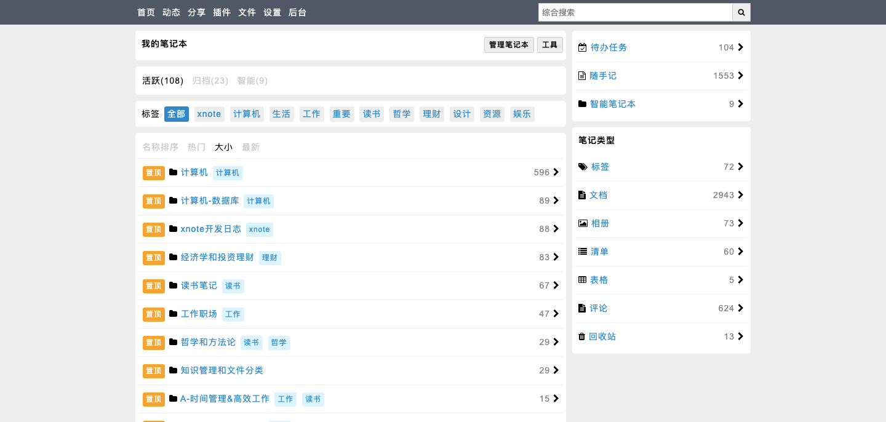

# Xnote

[](https://travis-ci.org/xupingmao/xnote)
[](https://coveralls.io/github/xupingmao/xnote?branch=master)

xnote是一款面向个人的轻量级笔记系统，提供多种维度的数据管理功能，致力于把个人从信息过载中解放出来。它主要有如下特性

- 拥有丰富的数据管理能力，支持多种笔记格式以及文件管理功能
- 默认提供了一些常用的工具，同时提供扩展能力，用户可以编写各种插件满足自己的需求
- 跨平台，支持Windows、Mac、Linux三大平台，可以在云服务上部署，也可以在本地运行
- 100%自由的数据控制权，可以运行在多种数据库环境中
- 支持小规模的多用户，面向多用户的商业场景使用请谨慎

目前xnote定位是一个面向个人使用的小型笔记产品，不会重点投入以下方向
- 大规模的多用户支持
- 多用户协作功能

如果你热爱技术爱折腾、需要多元的数据处理能力、希望完全掌控自己的文档数据，本产品将会是一个不错的尝试，欢迎试用反馈。


体验demo网址 https://1k5u680558.goho.co/

测试账号 user01/123456, user02/123456 友情提示：管理员会不定期清理数据，请勿存放重要数据

以下是一些页面展示




-----
## 项目地址

- [github](https://github.com/xupingmao/xnote)
- [gitee](https://gitee.com/xupingmao/xnote)

如果使用过程中遇到问题，欢迎在项目主页提issue或者评论。

## 安装&运行

### 安装依赖环境
- 安装python（建议Python3，Python2.7版本不再维护）
- 安装依赖的软件包
    - Mac/Linux执行 ```python -m pip install -r config/requirements.txt```
    - Windows执行 `python -m pip install -r config/requirements.win.txt`

### 配置和启动


默认的配置文件位于`config/boot/boot.default.properties`，具体的功能参考配置的注释

```sh
# 指定自定义的配置文件
python3 app.py --config config/boot/自定义名称.properties
```

如果不修改端口号，启动之后在浏览器打开 http://localhost:1234/ 就可以使用了，初始化的管理员账号是admin，默认密码是 123456

### 在云服务平台部署

- 新浪SAE TODO
- [CentOS - 百度BAE](https://blog.csdn.net/u011320646/article/details/126334377) 

### 兼容性问题

如果安装老版本后更新启动失败参考 [数据库迁移](./docs/db_migrate.md) 或者查看Issue，如果问题还没解决可以提交新的Issue

## 主要功能

### 笔记管理
- 支持多种格式：markdown/表格/相册/列表
- 组织功能：通过笔记本/标签/优先级来管理文档
- 分享功能：在笔记的详情页面，点击【更多】下拉列表里面的分享，可以将文章分享给未登录用户查看
- 优先级管理：置顶、归档功能
- 备份功能：笔记的修改历史
- 搜索功能：支持整个知识库搜索和项目内搜索
- 评论功能：支持登录用户的评论
- 访问统计：最近、常用的访问统计
- 其他文档工具

### 文件管理
- 多种视图：列表、网格
- 文件操作：文件上传、下载、新建、删除、重命名、移动等操作
- 文件工具：代码编辑器、文本阅读器、二进制查看器、文件内容搜索等等
- 大文件支持：文件下载支持断点续传，支持超大文件上传（测试过1G文件）
- 扩展：支持开发插件扩展

### 工具箱
- Python文档(pydoc)
- 文本处理(文本对比、代码生成、密码生成)
- 编解码工具(base64、md5、进制转换、等等)
- 条形码、二维码生成器
- 图像处理（合并、拆分、灰度转换）
- 提供扩展能力，开发者可以自己开发插件

## 系统扩展

由于每个人的需求不同，单一系统很难满足，开发者可以根据自己需要编写插件来扩展系统的功能。具体可以参考文档 [插件扩展](./docs/plugins.md)。

具体特性如下

- 插件中可以监听系统消息，包括笔记、提醒、文件、时间、系统五种类型的消息
- 插件可以通过`category`属性设置分类，显示在笔记、文件、系统等功能的选项入口中
- 可以通过模板创建插件

## 相关文档
- [更新日志](./docs/changelog.md)
- [系统架构](./docs/architecture.md)
- [编码规范](./docs/code_style.md)
- [插件扩展](./docs/plugins.md)
- [搜索扩展](./docs/search_extension.md)

## 协议

- GPL

